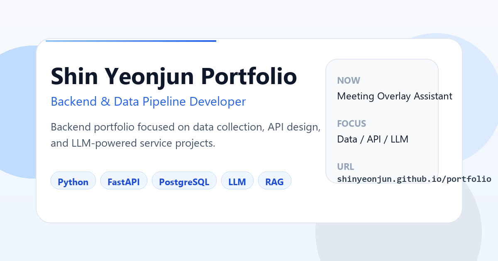

# Shin Yeonjun Portfolio

[](https://shinyeonjun.github.io/portfolio/)
[](https://shinyeonjun.github.io/portfolio/)
[](https://shinyeonjun.github.io/portfolio/#projects)

백엔드, 데이터 파이프라인, AI 자동화 프로젝트를 채용용으로 정리한 포트폴리오 사이트입니다.



## 한눈에 보기

- 라이브 사이트: <https://shinyeonjun.github.io/portfolio/>
- GitHub 프로필: <https://github.com/shinyeonjun>
- 중심 키워드: Data, API, LLM, Automation

## 수록 프로젝트

- Meeting Overlay Assistant
- AI Schedule Web
- DE-pipeline
- ControlDock
- Wedding Album Generator

## 이 포트폴리오에서 보여주는 것

- AI 기능을 실제 서비스 흐름으로 연결한 경험
- API, 데이터, UI를 하나의 시스템으로 묶어낸 방식
- 역할, 결과 화면, 구조 자료, 발표 자료까지 확인 가능한 프로젝트 기록

## 실행

```powershell
npm install
npm run dev
```

## 빌드

```powershell
npm run build
```
