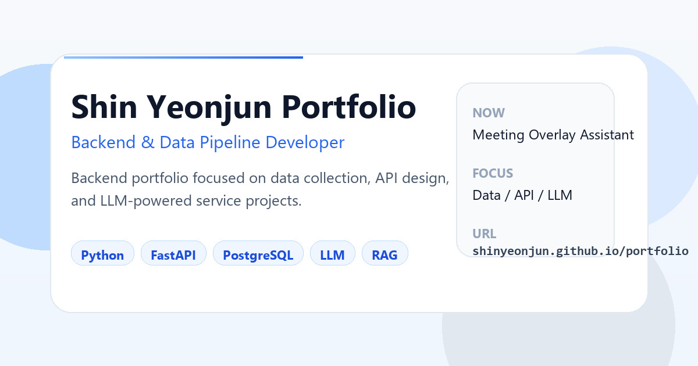

# Shin Yeonjun Portfolio

[](https://shinyeonjun.github.io/portfolio/)
[](https://shinyeonjun.github.io/portfolio/)
[](https://shinyeonjun.github.io/portfolio/#projects)

백엔드, 데이터 파이프라인, AI 서비스 통합 프로젝트를 채용용으로 정리한 GitHub Pages 포트폴리오입니다.



## What this portfolio shows

- 라이브 사이트: <https://shinyeonjun.github.io/portfolio/>
- GitHub 프로필: <https://github.com/shinyeonjun>
- 중심 키워드: Backend, Data Pipeline, API, AI Service Integration
- 각 프로젝트의 문제 정의, 역할, 결과 화면, 시스템 구조, 발표 자료

## Current projects

- Meeting Overlay Assistant
- DE-pipeline
- AI Schedule Web
- ControlDock
- Wedding Album Generator

The GitHub profile also highlights newer developer-tool projects such as [Backend Visual Map](https://github.com/shinyeonjun/visual_map) and [Database Memory MCP](https://github.com/shinyeonjun/rdb-memory-mcp). Their product details live in the corresponding repositories while portfolio-site case studies are updated separately.

## 실행

```powershell
npm install
npm run dev
```

## 빌드

```powershell
npm run build
```
